This app is deployed to Fly.io as 3 instances:

1. 🇺🇸 Sunnyvale
2. 🇫🇷 Paris
3. 🇸🇬 Singapore

We are doing this for higher availability & lower edge latency. This is what
that means for our end-users:

```mermaid
flowchart LR
    client_can("👩🏽 🇨🇦")
    client_usa("🧔🏻 🇺🇸")
    client_arg("👶🏻 🇦🇷")
    client_uk("👨🏻‍🦰 🇬🇧")
    client_fr("👨🏻‍💻 🇫🇷")
    client_in("👨🏾 🇮🇳")
    
    subgraph Fly.io
        registry_redirect_usa("🇺🇸 registry.dagger.io/engine")
        registry_redirect_fr("🇫🇷 registry.dagger.io/engine")
        registry_redirect_sgp(" 🇸🇬 registry.dagger.io/engine")
    end

    subgraph GitHub
        registry("🐙 ghcr.io/dagger/engine")
    end

    registry_redirect_usa --> registry
    registry_redirect_fr --> registry
    registry_redirect_sgp --> registry

    client_usa --> registry_redirect_usa
    client_can --> registry_redirect_usa
    client_arg --> registry_redirect_usa
    client_uk --> registry_redirect_fr
    client_fr --> registry_redirect_fr
    client_in --> registry_redirect_sgp
```

The above graph is a simplification. There are also **Edge** proxy instances
running within the Fly.io network that serve clients directly. These are
transparent to us, it's simply a Fly.io network optimisation. If you look at
the world map in the screenshot below, you will notice that my `docker pull
registry.dagger.io/engine:v0.6.4` above was actually serviced by the `LHR` edge
proxy which connected to our closest registry-redirect instance running in
`CDG` - 🇫🇷 Paris:

[`.github/workflows/dagger.yml`](.github/workflows/dagger.yml) workflow is
reponsible for testing, building, publishing & deploying the app.

### What other commands did we run to set this up?

- `flyctl apps create dagger-registry-2023-01-23`
- Configure `registry.dagger.io` A & AAAA DNS record
    - `flyctl ips list -a dagger-registry-2023-01-23`
- `flyctl certs create -a dagger-registry-2023-01-23 registry.dagger.io`
